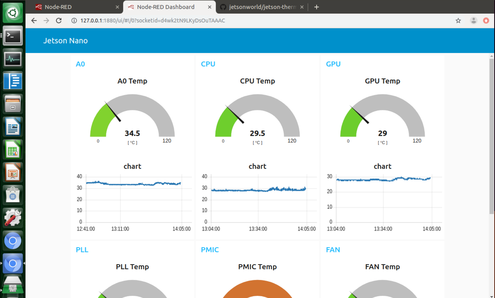
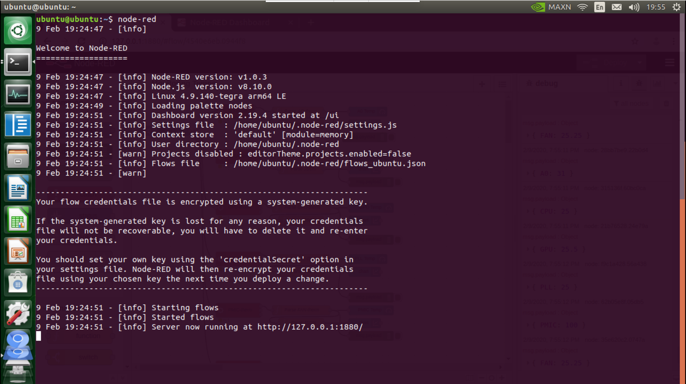
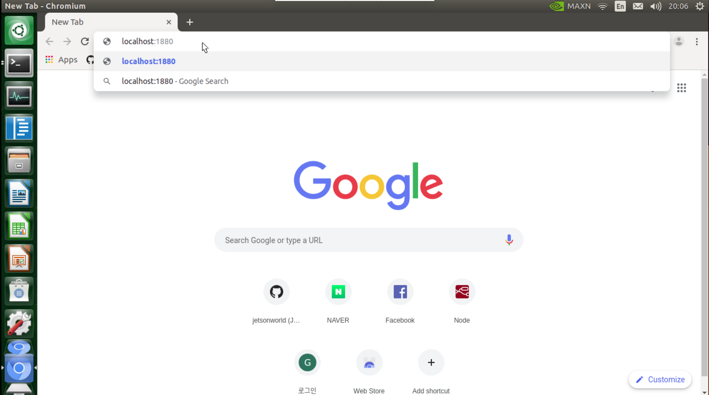
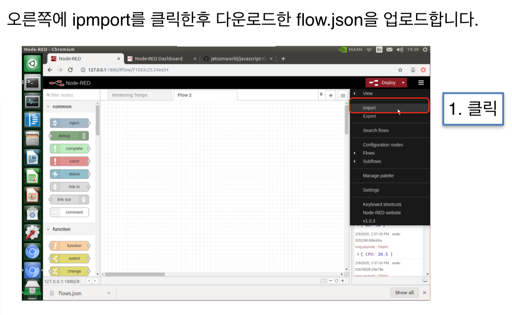
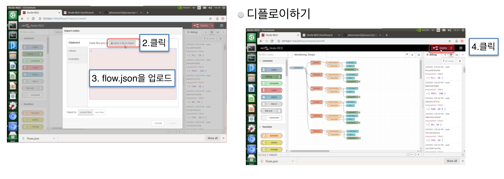
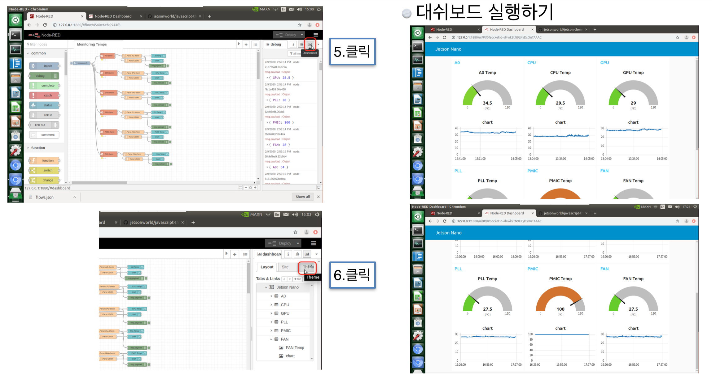

# 자바스크립트 젯슨나노 온도 모니터

젯슨나노의 모듈타입 온도센서 출력하기



# 설치하기
```
sudo apt update
sudo apt install nodejs
sudo apt install npm
sudo npm install -g --unsafe-perm node-red
node -v
npm -v

node-red
Ctrl + C 키로 종료합니다. 그런다음 .node-red 폴더가 생깁니다.
cd .node-red
npm install node-red-node-serialport
npm install node-red-contrib-moment
npm install node-red-dashboard

```

# 다운로드하기
```
wget https://raw.githubusercontent.com/jetsonworld/javascript-thermal-monitor/master/flows.json
```
위 주소를 복사해서 터미널에 입력한 후 엔터를 칩니다. flow.json 파일이 다운로드가 됩니다.


# 업로드하기

방금 다운로드한 flow.json 파일을 업로드하기 위해서 터미널에서 node-red를 입력한후 엔터를 칩니다.

# 구동하기
```
node-red
```



 노드레드가 실행되면서 자동으로 웹브라우져가 열립니다. 
만약에 자동으로 웹브라우져가 안열리면 웹을 열어서
localhost:1880 혹은 127.0.0.1:1880 을 아래와 같이 
입력하세요.










# 노트
- 이 매뉴얼은 젯슨나노에서만 테스트했습니다.
